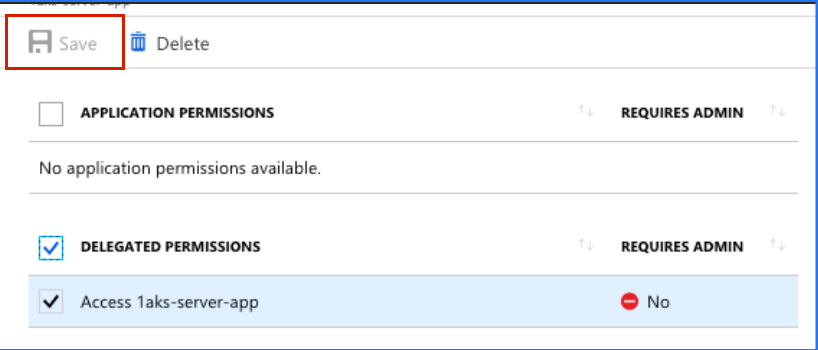
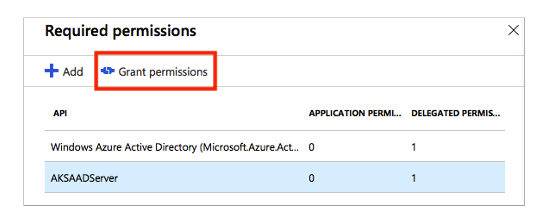
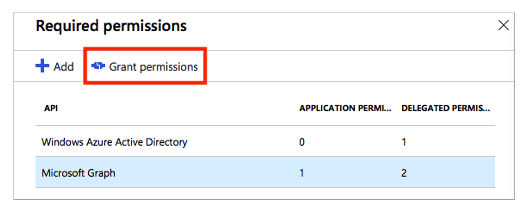

# Grant Permmissions

In order to grant permissions to the client and server applications you must be tennant admin.  

## Client application

Select `Azure Active Directory` > `App registrations` > `<YOUR_CLIENT_APP>` 

Then click on `Settings` > `Required permissions` > `<YOUR_SERVER_APP>` 

Select `Access <YOUR_SERVER_APP>` and click `Save`

Click `Grant Permissions`

## Server application

Select `Azure Active Directory` > `App registrations` > `<YOUR_SERVER_APP>`

Then click on `Settings` > `Required permissions`

Click `Grant Permissions`

